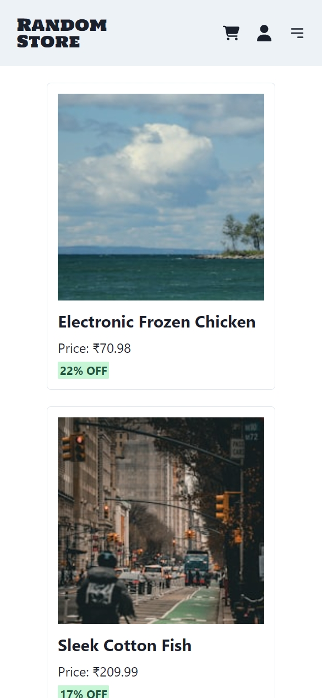
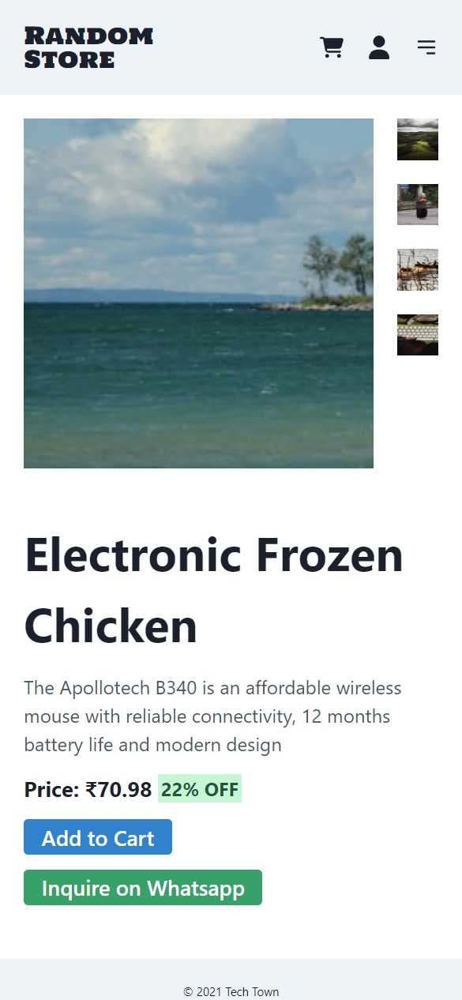
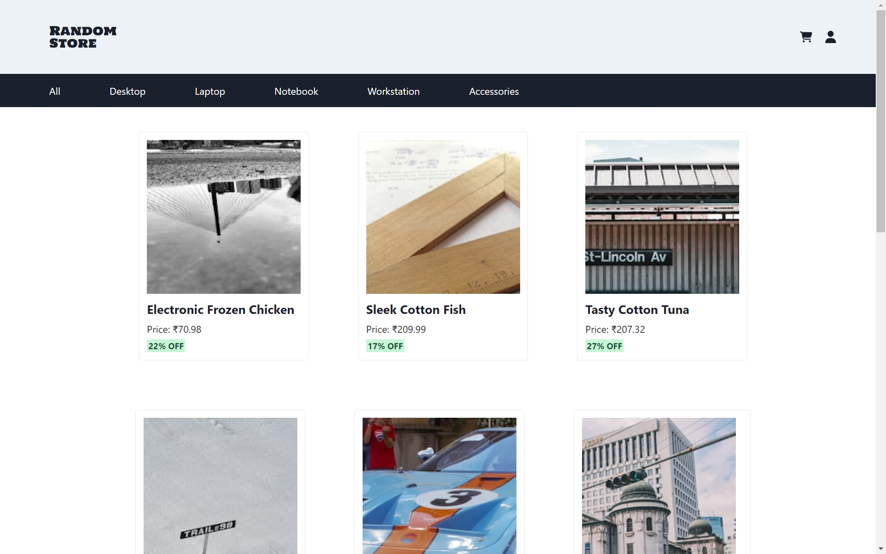
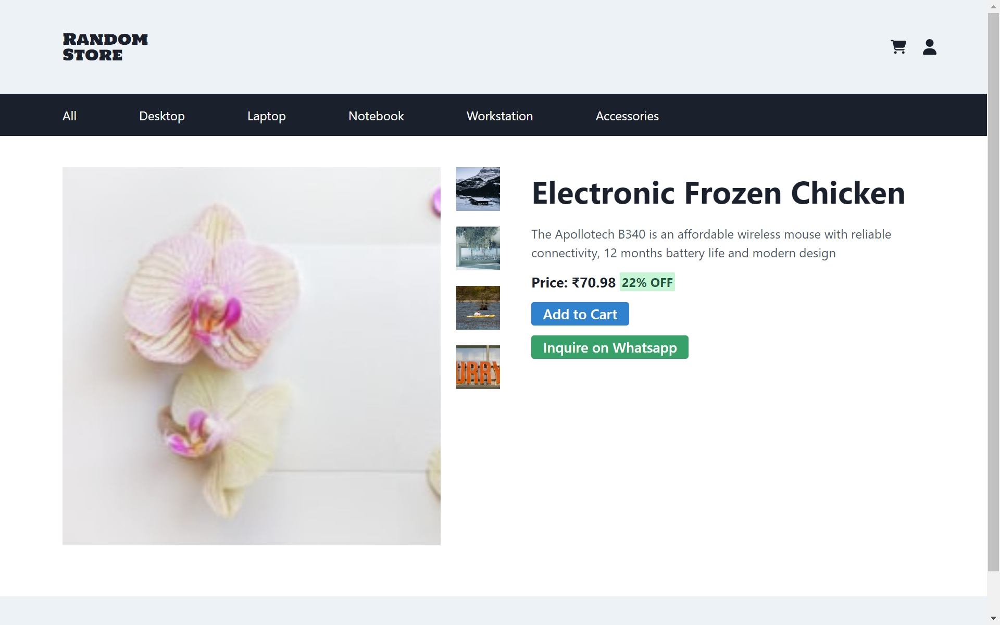

# Axion Play Assignment - E-commerce Catalogue + Product Page

This project is a take-home assignment for the React Developer role at Axion Play.

## Details

Following are the details about this assignment:

1. Create a fully responsive react frontend application where the home page shows a product catalogue with > 20 products.
2. Use pagination or infinite scrolling on the home page to list multiple products.
3. Each listed product will have a photo, Name, and Price on the home page.
4. Clicking on every product listing should redirect to the specific product’s page with more detailed information about the product.
   - This product details page should contain the product’s name, multiple photos of the product, price, a button to (inquire on WhatsApp), description section for the product.
   - For each product, clicking on the “Inquire on Whatsapp” button should redirect to open a WhatsApp message to be sent to the phone number (+91-8787878787) saying: “Hey, I am interested in buying [product_name]-[price].”

5. The styling, preferably, should be done using Charka UI.
6. For data, use a JSON file containing a list of products. Each product's data JSON object should include the product's name, unique_id, description, list of all the photos via links, price, etc.

## My Solution

I have made a catalogue and product description pages with a basic UI.

Live Link: [https://anshumanmahato.github.io/axionplay-react-assignment/](https://anshumanmahato.github.io/axionplay-react-assignment/)

### Features.

- The catalogue page has pagination and shows 12 products at a time.
- The product page features an Image Gallery to select different product images.
- "Inquire on WhatsApp" button
- This project has been deployed on GitHub Pages.

### Technologies used

- React
- React Router Dom
- Chakra UI

### Setup instructions

1. Clone this repository.

```sh {"id":"01HYR1TZF1PJ8DHMSHEGYJXZ37"}
git clone https://github.com/AnshumanMahato/axionplay-react-assignment.git
```

2. Navigate to the project directory.

```sh {"id":"01HYR1TZF1PJ8DHMSHEMAVVQQX"}
cd axionplay-react-assignment
```

3. Install dependencies

```sh {"id":"01HYR1TZF1PJ8DHMSHEP7BW57P"}
npm install
```

4. Run the application

```sh {"id":"01HYR1TZF1PJ8DHMSHESRRQZNH"}
npm run dev
```

With this, your application should be up and running at `http://localhost:5173/axionplay-react-assignment/`

### Screenshots

**Mobile**




**Desktop**


<br/><br/>


### Note

- I have kept the UI very simple as this was my first time using Chakra UI.
- Data generation was tedious so I used Faker to create random data and fetched images from Unsplash. So they may not make sense.
- The navbar isn't functional.


